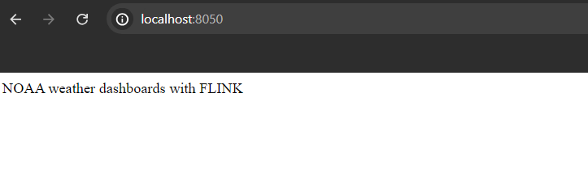
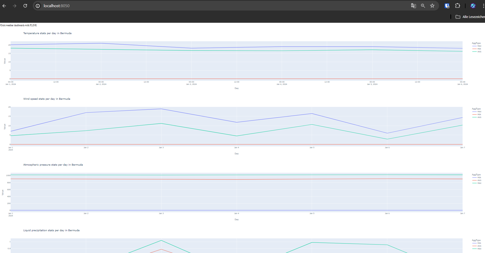
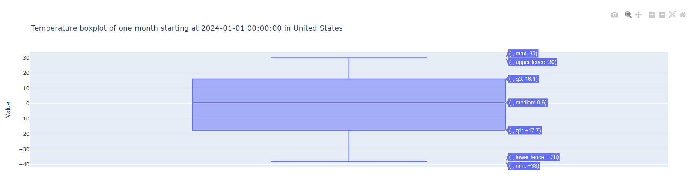
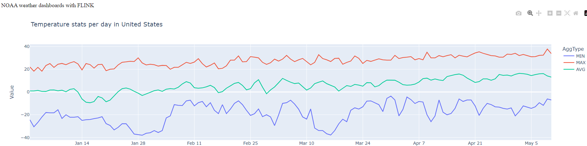

# Aufgabe: NOAA + Flink

**Projektteam**

- Noah Sutter
- Fabian Egartner
- Fabian Dreher
- Irina Grabher Meier

> _Nur weil's Flink heißt, ists nicht flink gemacht_ - Noah Sutter, 2024

## How To Run

Wir stellen eine Docker-Compose Konfiguration zur Verfügung sowie ein Startup-Script [SubmitFlinkJob.ps1](./SubmitFlinkJob.ps1), welches in folgender Reihenfolge folgendes Ausführt:

1. Die bestehende Infrastruktur plättet
2. Alle Container wieder startet
3. Unser Job-Java-Projekt frisch buildet
4. Den gebuildeten Job in den Container lädt und über die Flink-CLI startet

Da wir sehr viel mit den Daten anstellen, braucht das initiale Verabeiten etwas länger und braucht auch einiges an Ressourcen. Fortlaufende Updates (die nur einmal täglich sind, obwohl wir alle 2 min pollen) werden automatisch erkannt und angewandt.

## Ergebnisse

### Speichern der Daten

Unsere flinken Sink-Funktionen sind alles Postgres-Sinks, wir speichern unsere Daten in einer Postgres-Datenbank ab. Urspünglich war gedacht, dass wir direkt auf die Datastreams für die Visualisierung zugreifen, jedoch wurde dass schnell wieder verworfen besonders nachdem uns ChatGPT empfohlen hat, dass wir unsere Daten zuerst in Kafka schreiben, um sie dann dort auszulesen. [Chat GPT Request - Flink Stream Boxplot Python](https://chatgpt.com/share/85b3deae-f47f-4872-9713-2023108105cc)

### Realtime Streaming

Wir haben großen Wert im Projekt darauf gelegt, dass unsere Daten auch wirklich in Echtzeit empfangen und gestreamt werden - auch wenn nur einmal täglich die Dateien auf dem FTP-Server geupdated werden. Jede Station hat ihre eigene Datei und diese wird fortlaufend über das Jahr erweitert, Änderungen werden also nicht in eine neue Datei geschrieben. Dies machte ein vernünftiges Auslesen zur Herausforderung. \
Für ein zuverlässiges Auslesen der Daten müsste Watermarking verwendet werden, was problematisch ist, da die Zeitabstände zwischen ProcessTime und EventTime beim erstmaligen Laden sehr hoch sind.
Dafür haben wir etwas in der FTP-Source getrickst: Wir laden zuerst alle Dateien, die wir bebachten, sortieren die Einträge dann zusammen in einer Liste nach ihrer Event-Time und erst dann sendet die neuen Daten in Flink rein. Vorteil daran: Wir können mit der EventTime arbeiten, die Reihenfolge ist immer richtig und wir können auf Watermarking verzichten.

### Messwerte

Wir verarbeiten in unserem System vier verschiedene Sensordaten:

- Temperatur in °C
- Windgeschwindigkeit in km/h
- Luftdruck in Hectopascal
- Niederschlag: Der Niederschlag ist ein optionaler Wert und ist damit in verhältnismäßig wenigen Einträgen vorhanden. Für das Auslesen des Niederschlags war daher eine etwas kompliziertere Logik benötigt. Einheit in mm = Liter pro m²

### Joining Data

Die Master-Location-Identifier-Daten konnten einfach über eine CSV-Source, die von Flink bereitgestellt wurde, als DataStream ausgelesen werden. \
Flink gibt uns die Möglichkeit, zwei Datastreams zu joinen. Dies passiert über eine Join-Funktion, Windowing und eine Transformations-Funktion zum Zusammenfügen der Ströme. Unter dem "Joinen" versteht sich jedoch, dass zwei Datastreams zusammengefügt werden, kontinuierlich neue Daten verarbeiten.\
Das war jedoch bei uns nicht der Fall, die Master-Location-Identifier waren bei uns eine statische CSV-Datei. Für diesen Fall hat Apache Flink Broadcast-Streams. Und so sind wir von einem IntervalJoin auf einen Broadcast-Stream mit unseren statischen Daten gewechselt, der dann in unseren DataStream connected wurde.\
Gejoint wird über die WBAN, daher wählen wir nur Wetterstationen in der FTP-Source aus, die eine WBAN haben.\
Alle Einträge werden vor weiterer Verarbeitung gejoint.

### Live-Values

Ein Teil unseres Systems speichert und updated Live-Wetterdaten fortlaufend. Es wird immer der jüngste Wert, für jeden Messwert, für jede Wetterstation gespeichert. Invalide Werte werden zuvor rausgefiltert. In der Tabelle `live_values` sind diese Daten einsehbar. \
Es wird der Country (von MLID), Lat und Lon ebenfalls mitgespeichert, das würde eine Visualisierung auf einer Landkarte für jede Station ermöglichen.

### Quality Code Counting

Wir zählen die Häufigkeit Quality Codes, mit welchen später weitere Auswertungen gemacht werden können. Dabei werden zuerst Messungen mit einem invaliden Wert gefiltert. Das Hochzählen der Qualiticodes machen wir:

- Für 3 Zeitfenstergrößen (Tag, Woche, Monat)
- Für alle 4 Messwerte
- pro Wetterstation
- pro Zeitfenster (Tumbling Window)
  In der Tabelle `quality_codes` sind diese Daten einsehbar. `start_ts` gibt dabei die Erste Messung eines Zeitfensters an und mit `duration_days` wird angegeben, wie lange das Zeitfenster geht.

### Aggregated Data

Nach dem Filtern der eingehenden Daten aggregieren wir sie, um diverse Kennwerte zu berechnen. Diese Aggregationen finden:

- für alle 4 Messwerte
- Für 3 Zeitfenstergrößen (Tag, Woche, Monat)
- pro Country
- pro Zeitfenster (Tumbling Window)
- pro Aggegationstyp statt.

In der Tabelle `aggregated_data` sind diese Daten einsehbar. `start_ts` gibt dabei die Erste Messung eines Zeitfensters an und mit `duration_days` wird angegeben, wie lange das Zeitfenster geht. Der `aggregation-type` gibt an, was berechnet wurde:

- `COUNT`: Zählt die Anzahl der Einträge, über die aggregiert wurde. Damit können die Aggregationswerte in ein Verhältnis gesetzt werden
- `AVG`: Mittelwertberechnung
- `MIN`: Minimaler Wert
- `MAX`: Maximaler Wert
- `MEDIAN`: Mittelster Wert
- `Q1`: Wert des ersten Quartils
- `Q3` Wert des dritten Quartils
- `WHISKER_L`: Unterer Whisker-Wert eines Boxplots
- `WHISKER_U`: Oberer Whisker-Wert eines Boxplots
- `STD`: Standardabweichung
  Durch diese Kennwerte kann z.B. auch ein Boxplot konstruiert werden.

Für eine andere, vielleicht besser lesbare Darstellung kann folgende Query verwendet werden:

```sql
SELECT
    country,
    measurement_type,
    start_ts,
    duration_days,
    MAX(CASE WHEN aggregation_type = 'MIN' THEN value END) AS MIN,
    MAX(CASE WHEN aggregation_type = 'WHISKER_L' THEN value END) AS WHISKER_L,
    MAX(CASE WHEN aggregation_type = 'Q1' THEN value END) AS Q1,
    MAX(CASE WHEN aggregation_type = 'MEDIAN' THEN value END) AS MEDIAN,
    MAX(CASE WHEN aggregation_type = 'AVG' THEN value END) AS AVG,
    MAX(CASE WHEN aggregation_type = 'Q3' THEN value END) AS Q3,
    MAX(CASE WHEN aggregation_type = 'WHISKER_U' THEN value END) AS WHISKER_U,
    MAX(CASE WHEN aggregation_type = 'STD' THEN value END) AS STD,
    MAX(CASE WHEN aggregation_type = 'COUNT' THEN value END) AS CNT
FROM
    aggregated_data
GROUP BY
    country,
    measurement_type,
    start_ts,
    duration_days;
```

## Dashboards

Zusätzlich wurde eine Applikation in Python geschrieben, die ebenfalls im Docker gehostet wird und auf `http://localhost:8050/` erreichbar ist.

Zu sehen sind nur einige aggregierte Daten. Es ist möglich, dass die Darstellung aufgrund der verschiedenen Wertebereiche etwas rar oder falsch erscheint. Die Dashboards dienen nur zu einer flinken Übersicht, aufgrund dessen wurden die x- und y-Achsen nicht besser gehandhabt.

Zu Beginn wird auf `http://localhost:8050/` einfach eine Überschrift angezeigt. Nach und nach werden dann die Dashboards geladen. Für eine aktuellere Ansicht muss die Seite neu geladen werden bzw. ein neuer Request gesendet werden.



Es kann gut sein, dass es einige Zeit dauert, bis alles geschmeidig funktioniert. Sollte es Probleme geben, sollte eventuell der Container `python_dashboards` neu gestartet werden. Gibt es gröbere Probleme, so kann es helfen, die `python_dashboards` aus der `docker-compose` Datei zu entfernen und im Skript "SubmitFlinkJob.ps1" Folgendes zu entfernen: `--build python_dashboards`. Dann das Skript noch mal ausführen. Im Nachhinein kann `python_dashboards` noch mal einzeln gestartet werden. Dafür einfach die `docker-compose` Datei zurücksetzen und `docker compose up -d --build` ausführen.

Irgendwann sollte die Seite dem folgenden Bild ähneln.



Zu sehen sind Liniendiagramme der verschiedenen Länder, in denen das Minimum, Maximum und der Durchschnittswert pro Tag angezeigt werden. Dies wiederum wurde umgesetzt für die Temperatur, Windgeschwindigkeit, Luftdruck und Niederschlagsdaten. Sobald aggregierte Daten eines ganzen Monats zu Verfügung stehen, wird auch ein Boxplot Diagramm angezeigt für die Daten eines Monats pro Land und pro Messwerttyp. Pro Land werden dann noch die Live Daten in einem Liniendiagram zusammengefasst.




